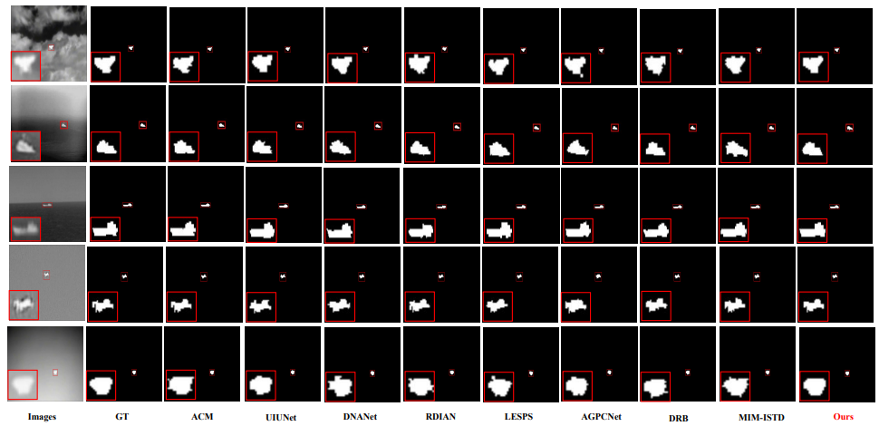

**Note:**   

We utilize the global and local prior characteristics of small infrared targets and propose a level-set based truth annotation pipeline.

The manuscript has been submitted to Measurement . All codes will be released after the manuscript is accepted.

**Results:** 

Compare the visualization results obtained from our method with different learning-based methods.Infrared small targets are emphasized and magnified by red rectangles.

---

------

**GUI SoftWare**   
We have designed an app using Maltab App Designer to help users quickly annotate. We will release our software after the manuscript is accepted. 

**Additional Expansion Packs **   

**References** 
If our work is useful to you please cite us.  

